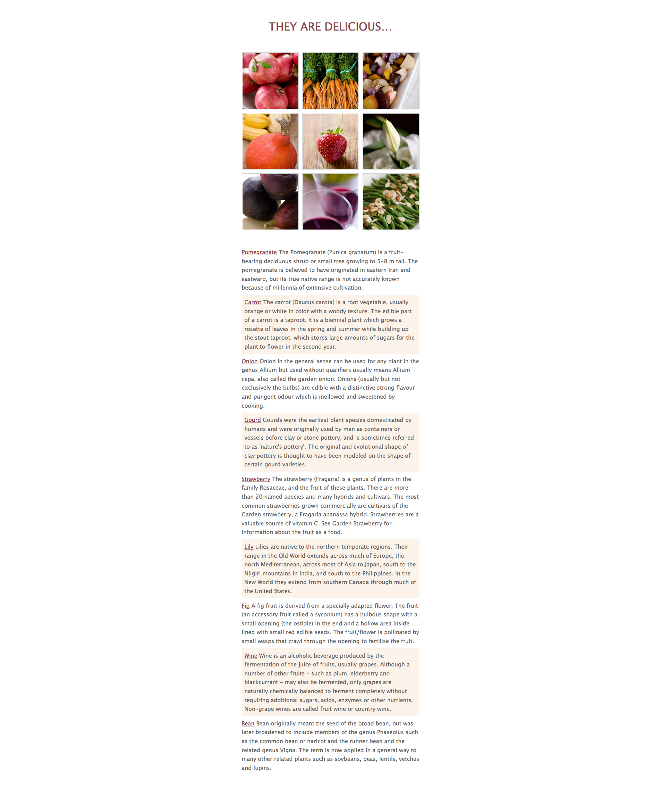

# CSS "Fwì"

> CSS exercise given at HEPL

* * *

**CSS "Fwì"** is an educational project, which will be used for `HTML`/`CSS` courses.

**Note:** the school where the course is given, the [HEPL](http://www.provincedeliege.be/hauteecole) from Liège, Belgium, is a french-speaking school. From this point, the instruction will be in french. Sorry.

* * *

> Lors de vos labos de *travaux dirigés*, vous allez découvrir le langage CSS et le mettre en pratique via de courts exercices de mise en situation.  
> Les labos de *travaux pratiques* vont vous confronter à des exercices pratiques et individuels reprenant la matière vue lors du TD précédent.

* * *

## Fwì

Les rendus final désiré est le suivant : 

Quelques rendus additionels (pour les états `hover` et `click`) se trouvent dans [le dossier rendus](./rendus).

### Consignes

* Sur base des rendus fournis et du fichier `index.html`, compléter le fichier `css/styles.css`
* Le but de l'exercice est d'utiliser les **positionnements relatifs et absolus**.

* * *

Code original par [Myriam Dupont](https://github.com/myriamdupont).
